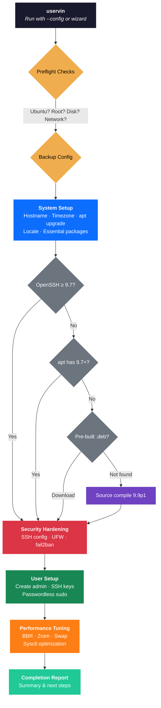

<p align="center">
  <h1 align="center">uservin</h1>
  <p align="center"><strong>Ubuntu Server Initialization Tool</strong></p>
  <p align="center">Automate the boring parts of server setup — security hardening, user management, system optimization, and post-quantum SSH — in a single command.</p>
</p>

<p align="center">
  <a href="https://opensource.org/licenses/MIT"></a>
  
  
  
  <a href="https://github.com/aprakasa/uservin/actions"></a>
  
  
  
</p>

---

## Why uservin?

Setting up a new Ubuntu server involves the same repetitive steps: update packages, create users, harden SSH, configure the firewall, tune performance. **uservin** handles all of this with a single script — and goes further by upgrading OpenSSH to 9.9p1 with post-quantum key exchange algorithms.

## How It Works



## Features

- **One-Liner Install** — Single command setup from GitHub Releases
- **Post-Quantum SSH** — ML-KEM (Kyber) and sntrup761x25519 key exchange via OpenSSH 9.9p1
- **Pre-Built Binaries** — Downloads pre-compiled OpenSSH `.deb` from GitHub Releases, falls back to source compile
- **Interactive Wizard** — Step-by-step configuration with sensible defaults
- **Config File Support** — Non-interactive setup via INI config file
- **SSH Hardening** — Key-only auth, custom port, disabled root login, strengthened ciphers
- **UFW Firewall** — Configured with SSH port and sensible defaults
- **fail2ban** — Intrusion prevention out of the box
- **Safety Features** — Dry-run mode, automatic backups, rollback on failure
- **Performance Tuning** — BBR congestion control, Zram, sysctl optimization
- **Auto-Detection** — Detects RAM and recommends swap/Zram settings
- **Background Execution** — Auto-backgrounds in interactive terminals so you can disconnect
- **Status Tracking** — Check progress anytime with `--status`
- **Comprehensive Logging** — All output saved to `/var/log/uservin/`

## Post-Quantum SSH

uservin upgrades OpenSSH to 9.9p1 on systems running OpenSSH < 9.7, enabling post-quantum key exchange algorithms:

| Algorithm | Type | Standard |
|-----------|------|----------|
| `mlkem768x25519-sha256` | ML-KEM (Kyber) hybrid | FIPS 203 |
| `sntrup761x25519-sha512` | NTRU hybrid | Classical |

### Upgrade Strategy (3-tier fallback)

1. **apt upgrade** — If the system repository already has OpenSSH 9.7+
2. **Pre-built `.deb`** — Downloads a pre-compiled `.deb` from [GitHub Releases](https://github.com/aprakasa/uservin/releases/tag/openssh-9.9p1-ubuntu24.04) and extracts binaries via `dpkg-deb -x` (no package manager conflicts)
3. **Source compile** — Downloads OpenSSH 9.9p1 source, verifies SHA256, compiles with `--prefix=/usr`, and installs binaries to system paths

The pre-built `.deb` packages are built via [GitHub Actions](.github/workflows/build-openssh.yml) on Ubuntu 24.04 with all dependencies.

### Verifying PQ Key Exchange

After setup, connect with verbose output to confirm:

```bash
ssh -v -p <port> <user>@<host>
# Look for: kex: algorithm: mlkem768x25519-sha256
```

## What Gets Configured

### System
- Hostname and timezone configuration
- Package updates (`apt update` / `upgrade` / `dist-upgrade`)
- Essential packages installation (curl, git, htop, ufw, fail2ban, etc.)
- System locale setup
- Automatic security updates (unattended-upgrades)

### Security
- OpenSSH upgrade with ML-KEM post-quantum key exchange (9.9p1)
- SSH hardening (custom port, disable root login, key-only auth, strong ciphers)
- UFW firewall with port configuration
- fail2ban intrusion prevention
- Post-quantum algorithms prepended in KexAlgorithms

### Users
- Non-root admin user creation
- SSH key authentication setup
- Sudo privileges with passwordless sudo

### Performance
- Linux kernel BBR congestion control
- Zram setup (compressed RAM swap)
- Traditional swap configuration
- Sysctl optimizations based on RAM

## Requirements

| Component | Minimum | Recommended |
|-----------|---------|-------------|
| OS | Ubuntu 20.04 LTS | Ubuntu 24.04 LTS |
| RAM | 512 MB | 1 GB+ |
| Disk | 10 GB | 20 GB+ |
| CPU | 1 core | 2+ cores |
| Access | Root | Root |
| Network | Internet | Internet |

Tested on Ubuntu 20.04, 22.04, and 24.04.

## Quick Start

### One-Liner Install

```bash
wget -qO- https://github.com/aprakasa/uservin/releases/latest/download/uservin.sh | sudo bash
```

### With Config File

```bash
curl -LO https://github.com/aprakasa/uservin/releases/latest/download/uservin.sh
chmod +x uservin.sh

cp config.example.ini config.ini
$EDITOR config.ini

sudo ./uservin.sh --config config.ini
```

### Build from Source

```bash
git clone https://github.com/aprakasa/uservin.git
cd uservin
make build
sudo ./uservin.sh
```

## Usage

```bash
sudo ./uservin.sh                  # Interactive wizard
sudo ./uservin.sh --config c.ini   # Config file mode
sudo ./uservin.sh --dry-run        # Preview changes without applying them
sudo ./uservin.sh --verbose        # Detailed output
sudo ./uservin.sh --quiet          # Errors only
sudo ./uservin.sh --no-background  # Keep in foreground
./uservin.sh --status              # Check progress of a running instance
./uservin.sh --help                # Show help
```

## Configuration Reference

Create an INI file to run non-interactively. See [`config.example.ini`](config.example.ini) for a fully annotated example:

```ini
[system]
hostname = myserver
timezone = Asia/Jakarta

[user]
username = admin
ssh_key = ssh-ed25519 AAAAC3NzaC1lZDI1NTE5AAAAI... user@example.com

[ssh]
port = 22

[updates]
auto_updates = true

[performance]
enable_swap = false
enable_zram = true
auto_detect = true
```

## Background Execution

When run interactively with a config file, uservin auto-backgrounds itself so you can disconnect immediately:

```bash
sudo ./uservin.sh --config config.ini
# Output:
# uservin is now running in background.
# Log file: /var/log/uservin/uservin-20250401-143022-12345.log

# Check progress
tail -f /var/log/uservin/uservin-*.log
./uservin.sh --status
```

### Foreground Mode

For debugging or CI/CD, keep the script in the foreground:

```bash
sudo ./uservin.sh --no-background
```

### Running on a Remote Server

Since SSH configuration changes may disconnect your session:

```bash
nohup ./uservin.sh --config config.ini --no-background > /tmp/uservin-output.log 2>&1 &
```

## Safety Features

- **Pre-flight checks** — Ubuntu version, root access, disk space, internet connectivity
- **Automatic backups** — All modified files backed up to `/root/uservin-backups/`
- **Rollback** — Automatic rollback on critical failures; trap-based cleanup on interruption
- **Dry-run mode** — Preview all changes without applying them

## Project Structure

```
uservin/
├── uservin.sh              # Bundled single-file script (generated by make build)
├── lib/                    # Modular library files
│   ├── utils.sh            # Logging, validation, helpers
│   ├── safety.sh           # Backup, rollback, preflight checks
│   ├── wizard.sh           # Interactive wizard, config file parsing
│   ├── system.sh           # System updates, OpenSSH upgrade/compile
│   ├── security.sh         # SSH hardening, UFW, fail2ban
│   ├── user.sh             # User creation, SSH keys
│   ├── performance.sh      # BBR, Zram, swap
│   ├── background.sh       # Auto-background execution
│   └── report.sh           # Setup orchestration, completion report
├── tests/                  # Test suite (74 tests)
├── .github/workflows/      # CI/CD
│   ├── build-openssh.yml   # Build pre-compiled OpenSSH .deb
│   ├── pr-checks.yml       # PR validation
│   ├── auto-build.yml      # Auto-rebuild uservin.sh
│   ├── release.yml         # Release automation
│   └── scheduled.yml       # Weekly tests
├── build.sh                # Build script
├── Makefile                # Build automation
├── config.example.ini      # Example configuration
└── VERSION                 # Version (single source of truth)
```

## Development

```bash
make build    # Bundle lib/ files into uservin.sh
make test     # Run 74 tests
make lint     # Run shellcheck
make clean    # Remove generated files
```

### Contributing

1. Fork the repository
2. Create a feature branch: `git checkout -b feature/my-feature`
3. Edit files in `lib/` (not `uservin.sh` — it is auto-generated)
4. Run `make build && make test`
5. Commit with [conventional commits](https://www.conventionalcommits.org/)
6. Push and submit a PR

## Troubleshooting

### Lost SSH Connection

Wait 2–3 minutes, then reconnect with your configured port:

```bash
ssh -p <port> <username>@<hostname>
```

### Check Logs

```bash
sudo tail -f /var/log/uservin/uservin-*.log
./uservin.sh --status
```

### OpenSSH Compile Failed

The script tries pre-built binaries first. If source compile also fails:

- Check `/tmp/openssh-build/` for build logs
- Ensure `build-essential` and `libssl-dev` are available
- Run `apt-get install -f -y` to fix broken dependencies

## License

[MIT](LICENSE)
